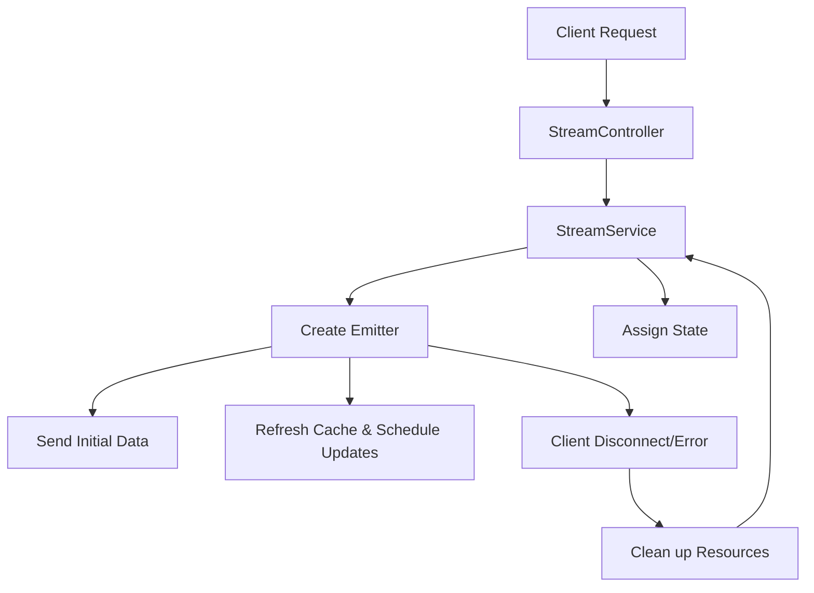

# Ordering Platform Real-Time Streaming Framework & State Management

## Overview

This document outlines the design of a real-time streaming framework for an ordering platform. The framework enables clients and frontend applications to receive live updates on order statuses, delivery progress, and other key events. It leverages a state-based management system that allows clients to subscribe to specific states of data and receive timely updates.

The framework ensures efficient data streaming by caching relevant data, applying client-specific filters, and refreshing the cache before sending data to clients. It also handles resource cleanup when clients disconnect or when errors occur.

## Key Concepts

### 1. StreamService

The StreamService is responsible for managing the lifecycle of real-time data streams, including:

- Registration of clients.
- State assignment (e.g., OrderState, MerchantState).
- Event broadcasting to the clients.
- Resource cleanup after client disconnection or errors.

### 2. State

The State interface represents different types of data within the system (e.g., OrderState, DeliveryState). Each state:

- Caches its data.
- Applies filters to return client-specific information.
- Refreshes the cache before sending data to clients to ensure the data is always up-to-date.

### 3. RequestContext

Encapsulates session-specific information like session IDs and request headers. It helps identify and manage subscriptions for each client.

### 4. Emitter

Emitters are responsible for sending real-time data updates to clients. They abstract the underlying process of managing a live connection and ensure that both initial data and periodic updates are sent to clients.

## System Design and Flow

## System Components and Code Explanation

### 1. StreamService

The StreamService manages the registration of client sessions, assigns the appropriate state, and sends both initial data and periodic updates to clients. The service also handles the cleanup of resources after clients disconnect or errors occur.

+++
    public class StreamService {

        private final Map<StateType, State<?>> states = new ConcurrentHashMap<>();

        public void registerState(StateType stateType, State<?> stateImplementation) {
            states.put(stateType, stateImplementation);
        }

        @Scheduled(fixedRate = 5000)
        public void sendPeriodicMessages() {
            emitters.forEach((entity, stateMap) -> {
                stateMap.forEach((stateType, sessionMap) -> {
                    sessionMap.forEach((sessionId, emitterContext) -> {
                        Emitter emitter = emitterContext.getEmitter();
                        RequestContext requestContext = emitterContext.getRequestContext();
                        try {
                            State<?> state = states.getOrDefault(stateType, defaultState);
                            
                            // Refresh cache before fetching and sending data
                            state.refreshCache();

                            String data = state.fetchData(requestContext);
                            emitter.send(data);
                        } catch (IOException e) {
                            emitter.completeWithError(e);
                            removeEmitter(entity, stateType, sessionId);
                        }
                    });
                });
            });
        }
    }
+++

### 2. State Interface with Cache Refreshing

The State interface ensures that every implementation of the state (e.g., OrderState, DeliveryState) handles

